# Pickom Enterprise Database Architecture

> **Проектировщик**: Senior Database Architect (10+ лет опыта)
> **Принципы**: DDD, CQRS, Event Sourcing, Микросервисная архитектура
> **Технологии**: PostgreSQL 15+, Redis, Event Store

## 🏗️ Архитектурные решения enterprise-уровня

### Критический анализ предыдущей версии:
1. ❌ **Монолитная структура** - сложно масштабировать
2. ❌ **Отсутствие доменной модели** - нарушение принципов DDD
3. ❌ **Смешение команд и запросов** - проблемы производительности
4. ❌ **Отсутствие аудита** - нет отслеживания изменений
5. ❌ **Неоптимальная нормализация** - избыточные JOIN'ы

### Новая архитектура основана на:
- **Domain-Driven Design (DDD)** - четкое разделение доменов
- **CQRS** - разделение команд и запросов
- **Event Sourcing** - полная история изменений
- **Aggregate Root Pattern** - инкапсуляция бизнес-логики
- **Saga Pattern** - управление распределенными транзакциями

## 🎯 Доменная модель

```mermaid
graph TB
    subgraph "User Management Domain"
        UM[User Management]
        UM --> UA[User Accounts]
        UM --> UP[User Profiles]
        UM --> UR[User Roles & Permissions]
    end

    subgraph "Location Domain"
        LD[Location Domain]
        LD --> GA[Geographic Areas]
        LD --> AD[Address Directory]
        LD --> RT[Route Optimization]
    end

    subgraph "Delivery Domain"
        DD[Delivery Domain]
        DD --> DR[Delivery Requests]
        DD --> DO[Delivery Orders]
        DD --> DT[Delivery Tracking]
    end

    subgraph "Marketplace Domain"
        MD[Marketplace Domain]
        MD --> OF[Offers & Bidding]
        MD --> MT[Matching Engine]
        MD --> PR[Pricing Engine]
    end

    subgraph "Payment Domain"
        PD[Payment Domain]
        PD --> PT[Payment Transactions]
        PD --> WM[Wallet Management]
        PD --> BL[Billing & Ledger]
    end

    subgraph "Communication Domain"
        CD[Communication Domain]
        CD --> NT[Notifications]
        CD --> MS[Messaging System]
        CD --> EM[Email Templates]
    end

    subgraph "Analytics Domain"
        AD2[Analytics Domain]
        AD2 --> RP[Reporting]
        AD2 --> MT2[Metrics & KPIs]
        AD2 --> ML[ML & Predictions]
    end
```



## 📊 Архитектурная диаграмма базы данных

```mermaid
erDiagram
    %% CORE DOMAIN - User Management
    USERS {
        uuid id PK
        varchar external_uid "Firebase/Auth0 ID"
        varchar email UK
        varchar phone_number UK
        boolean is_active
        smallint status_id FK
        timestamptz created_at
        timestamptz updated_at
        bigint version "Optimistic locking"
    }

    USER_PROFILES {
        uuid id PK
        uuid user_id FK
        varchar first_name
        varchar last_name
        varchar display_name
        text avatar_url
        date date_of_birth
        varchar preferred_language
        jsonb preferences
        jsonb verification_data
        timestamptz created_at
        timestamptz updated_at
        bigint version
    }

    USER_ROLES {
        smallint id PK
        varchar name UK
        varchar description
        jsonb permissions
        boolean is_active
        timestamptz created_at
    }

    USER_ROLE_ASSIGNMENTS {
        uuid id PK
        uuid user_id FK
        smallint role_id FK
        uuid assigned_by FK
        timestamptz assigned_at
        timestamptz expires_at
        boolean is_active
        jsonb assignment_context
    }

    USER_STATUSES {
        smallint id PK
        varchar name UK
        varchar description
        boolean allows_login
        boolean allows_transactions
    }

    %% LOCATION DOMAIN - Advanced Geographic Management
    GEOGRAPHIC_REGIONS {
        uuid id PK
        varchar name
        varchar code UK
        varchar type "country|region|city|district"
        uuid parent_region_id FK
        geometry boundary_polygon
        jsonb metadata
        boolean is_serviceable
        timestamptz created_at
    }

    LOCATIONS {
        uuid id PK
        uuid region_id FK
        varchar formatted_address
        point coordinates
        varchar street_number
        varchar street_name
        varchar city
        varchar postal_code
        varchar country_code
        jsonb geocoding_data
        decimal confidence_score
        boolean is_verified
        timestamptz created_at
        timestamptz last_verified_at
    }

    USER_SAVED_LOCATIONS {
        uuid id PK
        uuid user_id FK
        uuid location_id FK
        varchar label
        boolean is_default
        jsonb access_instructions
        timestamptz created_at
    }

    %% DELIVERY DOMAIN - Core Business Logic
    DELIVERY_REQUESTS {
        uuid id PK "Aggregate Root"
        uuid requester_id FK
        varchar request_number UK "DR-2024-000001"
        uuid pickup_location_id FK
        uuid delivery_location_id FK

        %% Package Information
        varchar title
        text description
        decimal weight_kg
        jsonb dimensions
        uuid package_category_id FK
        boolean is_fragile
        boolean requires_signature
        decimal declared_value_cents
        varchar currency_code

        %% Scheduling
        timestamptz requested_pickup_at
        timestamptz latest_delivery_at
        varchar priority_level "standard|urgent|express"

        %% Business State
        smallint status_id FK
        uuid assigned_driver_id FK
        decimal max_price_cents
        decimal final_price_cents

        %% Metadata
        jsonb special_instructions
        jsonb business_metadata
        timestamptz created_at
        timestamptz updated_at
        bigint version
    }

    DELIVERY_REQUEST_STATUSES {
        smallint id PK
        varchar name UK
        varchar description
        boolean is_initial
        boolean is_final
        boolean allows_modifications
        boolean allows_cancellation
        int sort_order
    }

    PACKAGE_CATEGORIES {
        uuid id PK
        varchar name UK
        varchar description
        decimal max_weight_kg
        jsonb size_limits
        decimal base_price_multiplier
        jsonb handling_requirements
        boolean is_active
    }

    %% MARKETPLACE DOMAIN - Sophisticated Offer Management
    DELIVERY_OFFERS {
        uuid id PK "Aggregate Root"
        uuid delivery_request_id FK
        uuid driver_id FK
        varchar offer_number UK "OF-2024-000001"

        %% Pricing
        decimal quoted_price_cents
        varchar currency_code
        jsonb price_breakdown

        %% Scheduling
        timestamptz estimated_pickup_at
        timestamptz estimated_delivery_at
        int estimated_duration_minutes

        %% Offer Details
        text driver_message
        jsonb vehicle_info
        jsonb driver_qualifications
        decimal confidence_score

        %% Business State
        smallint status_id FK
        timestamptz expires_at
        timestamptz responded_at
        varchar rejection_reason

        timestamptz created_at
        timestamptz updated_at
        bigint version
    }

    OFFER_STATUSES {
        smallint id PK
        varchar name UK
        varchar description
        boolean is_active
        boolean is_final
        int sort_order
    }

    %% EXECUTION DOMAIN - Order Fulfillment
    DELIVERY_ORDERS {
        uuid id PK "Aggregate Root"
        uuid delivery_request_id FK
        uuid accepted_offer_id FK
        varchar order_number UK "DO-2024-000001"
        uuid driver_id FK
        uuid customer_id FK

        %% Contract Terms
        decimal agreed_price_cents
        varchar currency_code
        jsonb service_level_agreement

        %% Execution State
        smallint status_id FK
        timestamptz pickup_scheduled_at
        timestamptz delivery_scheduled_at
        timestamptz pickup_completed_at
        timestamptz delivery_completed_at

        %% Quality Control
        varchar pickup_verification_code
        varchar delivery_verification_code
        jsonb pickup_photos
        jsonb delivery_photos
        text completion_notes

        timestamptz created_at
        timestamptz updated_at
        bigint version
    }

    ORDER_STATUSES {
        smallint id PK
        varchar name UK
        varchar description
        boolean is_active_execution
        boolean is_final
        varchar next_possible_statuses
        int sort_order
    }

    %% TRACKING DOMAIN - Real-time Monitoring
    DELIVERY_TRACKING_EVENTS {
        uuid id PK
        uuid delivery_order_id FK
        smallint event_type_id FK
        uuid location_id FK
        point gps_coordinates
        decimal accuracy_meters

        %% Event Data
        jsonb event_data
        text notes
        jsonb photos
        uuid created_by FK
        timestamptz occurred_at
        timestamptz recorded_at

        %% Analytics
        varchar device_info
        varchar app_version
        boolean is_automated
    }

    TRACKING_EVENT_TYPES {
        smallint id PK
        varchar name UK
        varchar description
        varchar category "milestone|location|status|exception"
        boolean is_customer_visible
        boolean triggers_notification
        jsonb required_data_schema
    }

    %% PAYMENT DOMAIN - Financial Management
    PAYMENT_ACCOUNTS {
        uuid id PK
        uuid user_id FK
        varchar account_type "wallet|external|escrow"
        varchar provider "stripe|paypal|internal"
        varchar external_account_id
        jsonb account_metadata
        boolean is_active
        boolean is_verified
        timestamptz created_at
    }

    FINANCIAL_TRANSACTIONS {
        uuid id PK
        varchar transaction_number UK "TX-2024-000001"
        uuid from_account_id FK
        uuid to_account_id FK
        uuid related_order_id FK

        %% Financial Data
        decimal amount_cents
        varchar currency_code
        varchar transaction_type "payment|refund|fee|commission"
        varchar payment_method

        %% External Integration
        varchar external_transaction_id
        varchar payment_provider
        jsonb provider_response

        %% State Management
        smallint status_id FK
        text failure_reason
        timestamptz initiated_at
        timestamptz completed_at
        timestamptz failed_at

        %% Reconciliation
        varchar reconciliation_batch_id
        boolean is_reconciled

        timestamptz created_at
        bigint version
    }

    TRANSACTION_STATUSES {
        smallint id PK
        varchar name UK
        varchar description
        boolean is_final
        boolean is_successful
        boolean allows_retry
    }

    %% RATING & REPUTATION DOMAIN
    DELIVERY_RATINGS {
        uuid id PK
        uuid delivery_order_id FK
        uuid rater_id FK
        uuid rated_user_id FK
        varchar rating_type "driver_rating|customer_rating"

        %% Rating Data
        smallint overall_rating "1-5"
        jsonb detailed_ratings
        text comment
        jsonb additional_feedback

        %% Moderation
        boolean is_verified
        boolean is_public
        uuid moderated_by FK
        text moderation_notes

        timestamptz created_at
        timestamptz moderated_at
    }

    USER_REPUTATION_SCORES {
        uuid id PK
        uuid user_id FK
        varchar score_type "driver|customer"

        %% Calculated Metrics
        decimal overall_score
        int total_ratings
        decimal avg_rating
        jsonb score_breakdown

        %% Ranking
        int percentile_rank
        varchar reputation_level "bronze|silver|gold|platinum"

        %% Metadata
        timestamptz calculated_at
        varchar calculation_version
        jsonb calculation_metadata
    }

    %% COMMUNICATION DOMAIN
    NOTIFICATION_TEMPLATES {
        uuid id PK
        varchar template_key UK
        varchar name
        text description
        varchar channel "push|email|sms|in_app"
        varchar language_code
        text subject_template
        text body_template
        jsonb template_variables
        boolean is_active
        timestamptz created_at
        timestamptz updated_at
    }

    USER_NOTIFICATIONS {
        uuid id PK
        uuid user_id FK
        uuid template_id FK
        varchar notification_type

        %% Content
        varchar title
        text message
        jsonb template_data

        %% Delivery
        varchar channel "push|email|sms|in_app"
        varchar external_message_id
        smallint status_id FK
        timestamptz sent_at
        timestamptz delivered_at
        timestamptz read_at
        timestamptz expires_at

        %% Context
        uuid related_entity_id
        varchar related_entity_type
        varchar action_url

        timestamptz created_at
    }

    NOTIFICATION_STATUSES {
        smallint id PK
        varchar name UK
        varchar description
        boolean is_final
    }

    %% AUDIT & EVENT SOURCING
    DOMAIN_EVENTS {
        uuid id PK
        varchar event_type
        uuid aggregate_id
        varchar aggregate_type
        bigint aggregate_version

        %% Event Data
        jsonb event_data
        jsonb metadata

        %% Traceability
        uuid user_id
        varchar correlation_id
        varchar causation_id
        varchar session_id

        %% Technical
        varchar event_schema_version
        timestamptz occurred_at
        timestamptz recorded_at

        %% Processing
        boolean is_processed
        timestamptz processed_at
        text processing_error
    }

    AUDIT_LOGS {
        uuid id PK
        varchar table_name
        varchar operation "INSERT|UPDATE|DELETE"
        uuid record_id

        %% Change Data
        jsonb old_values
        jsonb new_values
        jsonb changed_fields

        %% Context
        uuid changed_by
        varchar change_reason
        varchar application_name
        varchar ip_address
        varchar user_agent

        timestamptz changed_at
    }

    %% RELATIONSHIPS - Carefully designed with business logic in mind

    %% User Management Domain
    USERS ||--|| USER_PROFILES : "has_profile"
    USERS ||--o{ USER_ROLE_ASSIGNMENTS : "assigned_roles"
    USER_ROLES ||--o{ USER_ROLE_ASSIGNMENTS : "role_assignments"
    USER_STATUSES ||--o{ USERS : "current_status"
    USERS ||--o{ USER_SAVED_LOCATIONS : "saved_locations"

    %% Location Domain
    GEOGRAPHIC_REGIONS ||--o{ GEOGRAPHIC_REGIONS : "parent_child"
    GEOGRAPHIC_REGIONS ||--o{ LOCATIONS : "belongs_to_region"
    LOCATIONS ||--o{ USER_SAVED_LOCATIONS : "saved_as"
    LOCATIONS ||--o{ DELIVERY_REQUESTS : "pickup_location"
    LOCATIONS ||--o{ DELIVERY_REQUESTS : "delivery_location"

    %% Delivery Domain - Core Aggregates
    USERS ||--o{ DELIVERY_REQUESTS : "creates_requests"
    DELIVERY_REQUEST_STATUSES ||--o{ DELIVERY_REQUESTS : "current_status"
    PACKAGE_CATEGORIES ||--o{ DELIVERY_REQUESTS : "package_type"

    %% Marketplace Domain
    DELIVERY_REQUESTS ||--o{ DELIVERY_OFFERS : "receives_offers"
    USERS ||--o{ DELIVERY_OFFERS : "makes_offers"
    OFFER_STATUSES ||--o{ DELIVERY_OFFERS : "offer_status"

    %% Order Execution
    DELIVERY_REQUESTS ||--o{ DELIVERY_ORDERS : "fulfillment"
    DELIVERY_OFFERS ||--|| DELIVERY_ORDERS : "accepted_offer"
    ORDER_STATUSES ||--o{ DELIVERY_ORDERS : "execution_status"

    %% Tracking & Monitoring
    DELIVERY_ORDERS ||--o{ DELIVERY_TRACKING_EVENTS : "tracking_history"
    TRACKING_EVENT_TYPES ||--o{ DELIVERY_TRACKING_EVENTS : "event_classification"

    %% Payment & Financial
    USERS ||--o{ PAYMENT_ACCOUNTS : "owns_accounts"
    PAYMENT_ACCOUNTS ||--o{ FINANCIAL_TRANSACTIONS : "from_account"
    PAYMENT_ACCOUNTS ||--o{ FINANCIAL_TRANSACTIONS : "to_account"
    DELIVERY_ORDERS ||--o{ FINANCIAL_TRANSACTIONS : "order_payments"
    TRANSACTION_STATUSES ||--o{ FINANCIAL_TRANSACTIONS : "payment_status"

    %% Rating & Reputation
    DELIVERY_ORDERS ||--o{ DELIVERY_RATINGS : "order_feedback"
    USERS ||--o{ DELIVERY_RATINGS : "gives_rating"
    USERS ||--o{ DELIVERY_RATINGS : "receives_rating"
    USERS ||--|| USER_REPUTATION_SCORES : "reputation"

    %% Communication
    NOTIFICATION_TEMPLATES ||--o{ USER_NOTIFICATIONS : "template_instance"
    USERS ||--o{ USER_NOTIFICATIONS : "receives_notifications"
    NOTIFICATION_STATUSES ||--o{ USER_NOTIFICATIONS : "delivery_status"

    %% Audit & Events (Special relationships)
    USERS ||--o{ DOMAIN_EVENTS : "triggered_by"
    USERS ||--o{ AUDIT_LOGS : "changed_by"
```



## 🔧 Ключевые архитектурные паттерны

### 1. **Aggregate Root Pattern**
```sql
-- Каждый aggregate имеет версионирование для optimistic locking
ALTER TABLE delivery_requests ADD COLUMN version BIGINT DEFAULT 1;
ALTER TABLE delivery_offers ADD COLUMN version BIGINT DEFAULT 1;
ALTER TABLE delivery_orders ADD COLUMN version BIGINT DEFAULT 1;

-- Триггер для автоинкремента версии
CREATE OR REPLACE FUNCTION increment_version()
RETURNS TRIGGER AS $$
BEGIN
    NEW.version = OLD.version + 1;
    NEW.updated_at = CURRENT_TIMESTAMP;
    RETURN NEW;
END;
$$ LANGUAGE plpgsql;

CREATE TRIGGER trigger_increment_version_delivery_requests
    BEFORE UPDATE ON delivery_requests
    FOR EACH ROW EXECUTE FUNCTION increment_version();
```

### 2. **Event Sourcing Implementation**
```sql
-- Функция для записи domain events
CREATE OR REPLACE FUNCTION record_domain_event(
    p_event_type VARCHAR,
    p_aggregate_id UUID,
    p_aggregate_type VARCHAR,
    p_aggregate_version BIGINT,
    p_event_data JSONB,
    p_user_id UUID DEFAULT NULL,
    p_correlation_id VARCHAR DEFAULT NULL
) RETURNS UUID AS $$
DECLARE
    event_id UUID;
BEGIN
    INSERT INTO domain_events (
        id, event_type, aggregate_id, aggregate_type,
        aggregate_version, event_data, user_id,
        correlation_id, occurred_at, recorded_at
    ) VALUES (
        gen_random_uuid(), p_event_type, p_aggregate_id,
        p_aggregate_type, p_aggregate_version, p_event_data,
        p_user_id, p_correlation_id, CURRENT_TIMESTAMP, CURRENT_TIMESTAMP
    ) RETURNING id INTO event_id;

    RETURN event_id;
END;
$$ LANGUAGE plpgsql;
```

### 3. **CQRS Read Models**
```sql
-- Materialized view для быстрых запросов
CREATE MATERIALIZED VIEW delivery_summary_view AS
SELECT
    dr.id,
    dr.request_number,
    dr.title,
    dr.status_id,
    drs.name as status_name,
    up_requester.display_name as requester_name,
    up_driver.display_name as driver_name,
    pickup_loc.formatted_address as pickup_address,
    delivery_loc.formatted_address as delivery_address,
    dr.final_price_cents,
    dr.currency_code,
    dr.created_at,
    dr.updated_at,

    -- Aggregated data
    (SELECT COUNT(*) FROM delivery_offers do WHERE do.delivery_request_id = dr.id) as offer_count,
    (SELECT AVG(quoted_price_cents) FROM delivery_offers do WHERE do.delivery_request_id = dr.id) as avg_offer_price,

    -- Latest tracking
    (SELECT dte.occurred_at
     FROM delivery_orders ord
     JOIN delivery_tracking_events dte ON dte.delivery_order_id = ord.id
     WHERE ord.delivery_request_id = dr.id
     ORDER BY dte.occurred_at DESC LIMIT 1) as last_tracking_update

FROM delivery_requests dr
LEFT JOIN delivery_request_statuses drs ON dr.status_id = drs.id
LEFT JOIN users u_requester ON dr.requester_id = u_requester.id
LEFT JOIN user_profiles up_requester ON u_requester.id = up_requester.user_id
LEFT JOIN users u_driver ON dr.assigned_driver_id = u_driver.id
LEFT JOIN user_profiles up_driver ON u_driver.id = up_driver.user_id
LEFT JOIN locations pickup_loc ON dr.pickup_location_id = pickup_loc.id
LEFT JOIN locations delivery_loc ON dr.delivery_location_id = delivery_loc.id;

-- Индексы для read model
CREATE INDEX idx_delivery_summary_status ON delivery_summary_view(status_id);
CREATE INDEX idx_delivery_summary_created_at ON delivery_summary_view(created_at DESC);
CREATE INDEX idx_delivery_summary_requester ON delivery_summary_view(requester_name);
```

### 4. **Advanced Indexing Strategy**
```sql
-- Composite indexes для реальных запросов
CREATE INDEX CONCURRENTLY idx_delivery_requests_active
ON delivery_requests(status_id, created_at DESC)
WHERE status_id IN (1, 2, 3); -- active statuses only

-- Partial indexes для часто используемых фильтров
CREATE INDEX CONCURRENTLY idx_delivery_requests_urgent
ON delivery_requests(requested_pickup_at, max_price_cents)
WHERE priority_level = 'urgent';

-- GIN indexes для JSONB поиска
CREATE INDEX CONCURRENTLY idx_delivery_requests_metadata
ON delivery_requests USING gin(business_metadata);

-- Spatial indexes для геопоиска
CREATE INDEX CONCURRENTLY idx_locations_coordinates
ON locations USING gist(coordinates);

CREATE INDEX CONCURRENTLY idx_geographic_regions_boundary
ON geographic_regions USING gist(boundary_polygon);

-- Expression indexes для вычисляемых значений
CREATE INDEX CONCURRENTLY idx_delivery_requests_price_per_km
ON delivery_requests((final_price_cents::decimal /
    ST_Distance(
        (SELECT coordinates FROM locations WHERE id = pickup_location_id),
        (SELECT coordinates FROM locations WHERE id = delivery_location_id)
    )));
```

### 5. **Data Partitioning Strategy**
```sql
-- Партиционирование по дате для больших таблиц
CREATE TABLE domain_events (
    -- columns definition
) PARTITION BY RANGE (recorded_at);

-- Создание партиций
CREATE TABLE domain_events_2024_q1 PARTITION OF domain_events
    FOR VALUES FROM ('2024-01-01') TO ('2024-04-01');

CREATE TABLE domain_events_2024_q2 PARTITION OF domain_events
    FOR VALUES FROM ('2024-04-01') TO ('2024-07-01');

-- Автоматическое создание партиций
CREATE OR REPLACE FUNCTION create_quarterly_partition(table_name TEXT, start_date DATE)
RETURNS VOID AS $$
DECLARE
    partition_name TEXT;
    end_date DATE;
BEGIN
    end_date := start_date + INTERVAL '3 months';
    partition_name := table_name || '_' || TO_CHAR(start_date, 'YYYY_Q');

    EXECUTE format('CREATE TABLE %I PARTITION OF %I FOR VALUES FROM (%L) TO (%L)',
                   partition_name, table_name, start_date, end_date);
END;
$$ LANGUAGE plpgsql;
```

### 6. **Advanced Constraints & Business Rules**
```sql
-- Сложные business constraints
ALTER TABLE delivery_requests ADD CONSTRAINT chk_delivery_requests_business_rules
CHECK (
    -- Pickup должен быть раньше delivery
    (requested_pickup_at < latest_delivery_at) AND
    -- Max price должна быть больше 0
    (max_price_cents > 0) AND
    -- Нельзя доставлять в ту же точку
    (pickup_location_id != delivery_location_id) AND
    -- Final price не может превышать max price
    (final_price_cents IS NULL OR final_price_cents <= max_price_cents)
);

-- Exclusion constraints для предотвращения конфликтов
ALTER TABLE delivery_offers ADD CONSTRAINT excl_one_active_offer_per_driver_per_request
EXCLUDE USING gist (
    delivery_request_id WITH =,
    driver_id WITH =
) WHERE (status_id IN (1, 2)); -- pending, counter_offer statuses

-- Row Level Security для мультитенантности
ALTER TABLE delivery_requests ENABLE ROW LEVEL SECURITY;

CREATE POLICY delivery_requests_user_policy ON delivery_requests
    FOR ALL TO application_role
    USING (
        requester_id = current_setting('app.current_user_id')::uuid OR
        assigned_driver_id = current_setting('app.current_user_id')::uuid OR
        EXISTS (
            SELECT 1 FROM user_role_assignments ura
            JOIN user_roles ur ON ura.role_id = ur.id
            WHERE ura.user_id = current_setting('app.current_user_id')::uuid
            AND ur.name IN ('admin', 'moderator')
            AND ura.is_active = true
        )
    );
```