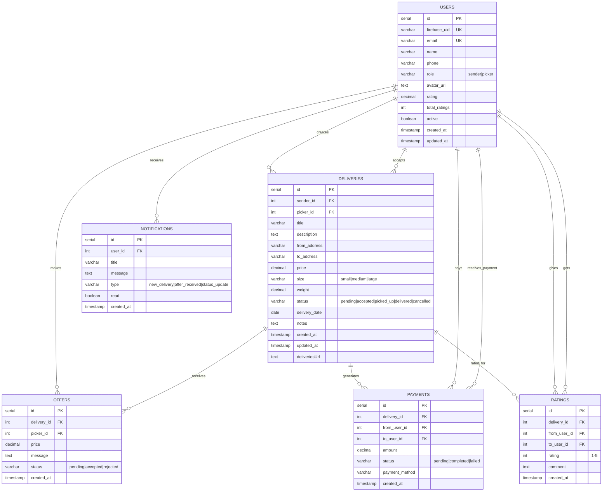

# Pickom MVP Database Schema

> **Цель**: Minimum Viable Product - простая, быстрая, работающая база данных
> **Принцип**: "Make it work, then make it better"

## 🎯 MVP Фичи (только самое необходимое)

1. ✅ **Пользователи** - регистрация, профиль, роли
2. ✅ **Доставки** - создать заявку, принять, отследить
3. ✅ **Предложения** - пикеры могут предлагать цену
4. ✅ **Базовые платежи** - кто кому сколько должен
5. ✅ **Простые уведомления** - что происходит с заказом
6. ✅ **Рейтинги** - оценить после доставки

## 📊 Простая схема базы данных



## 🗃️ SQL Schema для MVP

### 1. Пользователи
```sql
CREATE TABLE users (
    id SERIAL PRIMARY KEY,
    firebase_uid VARCHAR(128) UNIQUE NOT NULL,
    email VARCHAR(255) UNIQUE NOT NULL,
    name VARCHAR(100) NOT NULL,
    phone VARCHAR(20),
    role VARCHAR(10) NOT NULL CHECK (role IN ('sender', 'picker')),
    avatar_url TEXT,
    rating DECIMAL(2,1) DEFAULT 0.0,
    total_ratings INTEGER DEFAULT 0,
    active BOOLEAN DEFAULT true,
    created_at TIMESTAMP DEFAULT CURRENT_TIMESTAMP,
    updated_at TIMESTAMP DEFAULT CURRENT_TIMESTAMP
);

-- Простые индексы
CREATE INDEX idx_users_firebase_uid ON users(firebase_uid);
CREATE INDEX idx_users_email ON users(email);
CREATE INDEX idx_users_role ON users(role);
```

### 2. Доставки
```sql
CREATE TABLE deliveries (
    id SERIAL PRIMARY KEY,
    sender_id INTEGER NOT NULL REFERENCES users(id),
    picker_id INTEGER REFERENCES users(id),

    title VARCHAR(200) NOT NULL,
    description TEXT,

    -- Простые адреса и координаты
    from_address VARCHAR(500) NOT NULL,
    to_address VARCHAR(500) NOT NULL,
    from_lat DECIMAL(10, 8),
    from_lng DECIMAL(11, 8),
    to_lat DECIMAL(10, 8),
    to_lng DECIMAL(11, 8),

    price DECIMAL(10, 2) NOT NULL,
    size VARCHAR(10) CHECK (size IN ('small', 'medium', 'large')),
    weight DECIMAL(5, 2),

    status VARCHAR(20) DEFAULT 'pending'
        CHECK (status IN ('pending', 'accepted', 'picked_up', 'delivered', 'cancelled')),

    delivery_date DATE,
    notes TEXT,

    created_at TIMESTAMP DEFAULT CURRENT_TIMESTAMP,
    updated_at TIMESTAMP DEFAULT CURRENT_TIMESTAMP
);

-- Индексы для основных запросов
CREATE INDEX idx_deliveries_sender ON deliveries(sender_id);
CREATE INDEX idx_deliveries_picker ON deliveries(picker_id);
CREATE INDEX idx_deliveries_status ON deliveries(status);
CREATE INDEX idx_deliveries_date ON deliveries(delivery_date);
CREATE INDEX idx_deliveries_created ON deliveries(created_at DESC);
```

### 3. Предложения
```sql
CREATE TABLE offers (
    id SERIAL PRIMARY KEY,
    delivery_id INTEGER NOT NULL REFERENCES deliveries(id),
    picker_id INTEGER NOT NULL REFERENCES users(id),

    price DECIMAL(10, 2) NOT NULL,
    message TEXT,

    status VARCHAR(20) DEFAULT 'pending'
        CHECK (status IN ('pending', 'accepted', 'rejected')),

    created_at TIMESTAMP DEFAULT CURRENT_TIMESTAMP,

    -- Один пикер = одно предложение на доставку
    UNIQUE(delivery_id, picker_id)
);

CREATE INDEX idx_offers_delivery ON offers(delivery_id);
CREATE INDEX idx_offers_picker ON offers(picker_id);
CREATE INDEX idx_offers_status ON offers(status);
```

### 4. Платежи
```sql
CREATE TABLE payments (
    id SERIAL PRIMARY KEY,
    delivery_id INTEGER NOT NULL REFERENCES deliveries(id),
    from_user_id INTEGER NOT NULL REFERENCES users(id),
    to_user_id INTEGER NOT NULL REFERENCES users(id),

    amount DECIMAL(10, 2) NOT NULL,
    status VARCHAR(20) DEFAULT 'pending'
        CHECK (status IN ('pending', 'completed', 'failed')),
    payment_method VARCHAR(50),

    created_at TIMESTAMP DEFAULT CURRENT_TIMESTAMP
);

CREATE INDEX idx_payments_delivery ON payments(delivery_id);
CREATE INDEX idx_payments_from_user ON payments(from_user_id);
CREATE INDEX idx_payments_to_user ON payments(to_user_id);
```

### 5. Рейтинги
```sql
CREATE TABLE ratings (
    id SERIAL PRIMARY KEY,
    delivery_id INTEGER NOT NULL REFERENCES deliveries(id),
    from_user_id INTEGER NOT NULL REFERENCES users(id),
    to_user_id INTEGER NOT NULL REFERENCES users(id),

    rating INTEGER NOT NULL CHECK (rating >= 1 AND rating <= 5),
    comment TEXT,

    created_at TIMESTAMP DEFAULT CURRENT_TIMESTAMP,

    -- Один пользователь может оценить другого только раз за доставку
    UNIQUE(delivery_id, from_user_id)
);

CREATE INDEX idx_ratings_delivery ON ratings(delivery_id);
CREATE INDEX idx_ratings_to_user ON ratings(to_user_id);
```

### 6. Уведомления
```sql
CREATE TABLE notifications (
    id SERIAL PRIMARY KEY,
    user_id INTEGER NOT NULL REFERENCES users(id),

    title VARCHAR(255) NOT NULL,
    message TEXT NOT NULL,
    type VARCHAR(50) NOT NULL
        CHECK (type IN ('new_delivery', 'offer_received', 'offer_accepted', 'status_update', 'rating')),

    read BOOLEAN DEFAULT false,
    created_at TIMESTAMP DEFAULT CURRENT_TIMESTAMP
);

CREATE INDEX idx_notifications_user ON notifications(user_id);
CREATE INDEX idx_notifications_unread ON notifications(user_id, read) WHERE read = false;
```

## 🔧 Простые триггеры и функции

### 1. Автообновление updated_at
```sql
CREATE OR REPLACE FUNCTION update_timestamp()
RETURNS TRIGGER AS $$
BEGIN
    NEW.updated_at = CURRENT_TIMESTAMP;
    RETURN NEW;
END;
$$ LANGUAGE plpgsql;

CREATE TRIGGER trigger_users_updated_at
    BEFORE UPDATE ON users
    FOR EACH ROW EXECUTE FUNCTION update_timestamp();

CREATE TRIGGER trigger_deliveries_updated_at
    BEFORE UPDATE ON deliveries
    FOR EACH ROW EXECUTE FUNCTION update_timestamp();
```

### 2. Автообновление рейтинга пользователя
```sql
CREATE OR REPLACE FUNCTION update_user_rating()
RETURNS TRIGGER AS $$
BEGIN
    UPDATE users SET
        rating = (
            SELECT AVG(rating::decimal)
            FROM ratings
            WHERE to_user_id = NEW.to_user_id
        ),
        total_ratings = (
            SELECT COUNT(*)
            FROM ratings
            WHERE to_user_id = NEW.to_user_id
        )
    WHERE id = NEW.to_user_id;

    RETURN NEW;
END;
$$ LANGUAGE plpgsql;

CREATE TRIGGER trigger_update_user_rating
    AFTER INSERT ON ratings
    FOR EACH ROW EXECUTE FUNCTION update_user_rating();
```

### 3. Автосоздание платежа при принятии предложения
```sql
CREATE OR REPLACE FUNCTION create_payment_on_offer_accept()
RETURNS TRIGGER AS $$
DECLARE
    delivery_record deliveries%ROWTYPE;
BEGIN
    -- Только при принятии предложения
    IF NEW.status = 'accepted' AND OLD.status = 'pending' THEN
        -- Получаем информацию о доставке
        SELECT * INTO delivery_record
        FROM deliveries
        WHERE id = NEW.delivery_id;

        -- Обновляем доставку
        UPDATE deliveries SET
            picker_id = NEW.picker_id,
            price = NEW.price,
            status = 'accepted'
        WHERE id = NEW.delivery_id;

        -- Создаем платеж
        INSERT INTO payments (delivery_id, from_user_id, to_user_id, amount)
        VALUES (NEW.delivery_id, delivery_record.sender_id, NEW.picker_id, NEW.price);

        -- Отклоняем все остальные предложения
        UPDATE offers SET status = 'rejected'
        WHERE delivery_id = NEW.delivery_id AND id != NEW.id;
    END IF;

    RETURN NEW;
END;
$$ LANGUAGE plpgsql;

CREATE TRIGGER trigger_create_payment_on_offer_accept
    AFTER UPDATE ON offers
    FOR EACH ROW EXECUTE FUNCTION create_payment_on_offer_accept();
```

## 📱 Типовые запросы для MVP

### 1. Найти доступные доставки
```sql
-- Доставки рядом с пикером (простой поиск по координатам)
SELECT d.*, u.name as sender_name, u.rating as sender_rating
FROM deliveries d
JOIN users u ON d.sender_id = u.id
WHERE d.status = 'pending'
AND d.delivery_date >= CURRENT_DATE
AND (
    -- Простой расчет расстояния (не точный, но быстрый для MVP)
    ABS(d.from_lat - $1) + ABS(d.from_lng - $2) < 0.1 OR  -- ~10км
    ABS(d.to_lat - $1) + ABS(d.to_lng - $2) < 0.1
)
ORDER BY d.created_at DESC;
```

### 2. История доставок пользователя
```sql
-- Для отправителя
SELECT d.*, u.name as picker_name, p.status as payment_status
FROM deliveries d
LEFT JOIN users u ON d.picker_id = u.id
LEFT JOIN payments p ON d.id = p.delivery_id
WHERE d.sender_id = $1
ORDER BY d.created_at DESC;

-- Для пикера
SELECT d.*, u.name as sender_name, p.status as payment_status
FROM deliveries d
JOIN users u ON d.sender_id = u.id
LEFT JOIN payments p ON d.id = p.delivery_id
WHERE d.picker_id = $1
ORDER BY d.created_at DESC;
```

### 3. Активные предложения
```sql
SELECT o.*, d.title, d.from_address, d.to_address, u.name as picker_name
FROM offers o
JOIN deliveries d ON o.delivery_id = d.id
JOIN users u ON o.picker_id = u.id
WHERE d.sender_id = $1 AND o.status = 'pending'
ORDER BY o.created_at DESC;
```

## 🚀 Простые оптимизации для MVP

### 1. Кэширование в приложении
```javascript
// Кэшируем рейтинги пользователей на 1 час
const userRating = await redis.get(`user_rating_${userId}`);
if (!userRating) {
    const rating = await db.query('SELECT rating FROM users WHERE id = $1', [userId]);
    await redis.setex(`user_rating_${userId}`, 3600, rating);
}
```

### 2. Пагинация
```sql
-- Простая пагинация для списков
SELECT * FROM deliveries
WHERE status = 'pending'
ORDER BY created_at DESC
LIMIT 20 OFFSET $1;
```

### 3. Полнотекстовый поиск
```sql
-- Простой поиск по заголовку и описанию
SELECT * FROM deliveries
WHERE (title ILIKE '%' || $1 || '%' OR description ILIKE '%' || $1 || '%')
AND status = 'pending'
ORDER BY created_at DESC;
```

## 📝 Что НЕ включено в MVP (для будущих версий)

❌ Event Sourcing
❌ CQRS
❌ Микросервисы
❌ Сложная геолокация
❌ Мультивалютность
❌ Продвинутая аналитика
❌ Шифрование
❌ Партиционирование
❌ Реплики
❌ Сложные роли и права

## ✅ Достаточно для MVP

✅ Основной флоу: создать → предложить → принять → доставить → оценить
✅ Простые платежи
✅ Базовые уведомления
✅ Геопоиск по координатам
✅ Рейтинговая система
✅ Простой админ через SQL

**Принцип MVP**: Эта схема покрывает 80% функциональности при 20% сложности. Идеально для быстрого запуска и тестирования гипотез!