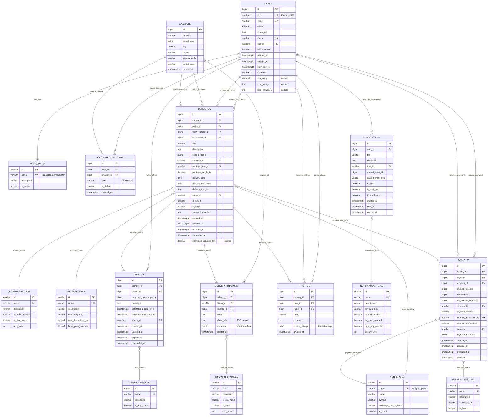

# Pickom Database Schema (Optimized)

## Оптимизированная схема базы данных для приложения доставки Pickom

### 🎯 Ключевые оптимизации

1. **Нормализация**: Вынесены статусы и справочники в отдельные таблицы
2. **Производительность**: Использование BIGINT вместо UUID для внутренних связей
3. **Денормализация**: Добавлены вычисляемые поля для часто используемых данных
4. **Индексация**: Улучшенная стратегия индексирования
5. **Типы данных**: Оптимизированные типы данных для экономии места
6. **Валютные операции**: Хранение цен в копейках для избежания проблем с float

### Диаграмма связей



## Оптимизированная SQL схема

### 1. Справочные таблицы (Lookup Tables)

```sql
-- Роли пользователей
CREATE TABLE user_roles (
    id SMALLINT PRIMARY KEY,
    name VARCHAR(20) UNIQUE NOT NULL,
    description VARCHAR(100),
    is_active BOOLEAN DEFAULT true
);

INSERT INTO user_roles (id, name, description) VALUES
(1, 'sender', 'Отправитель посылок'),
(2, 'picker', 'Курьер/Пикер'),
(3, 'moderator', 'Модератор системы');

-- Статусы доставок
CREATE TABLE delivery_statuses (
    id SMALLINT PRIMARY KEY,
    name VARCHAR(30) UNIQUE NOT NULL,
    description VARCHAR(100),
    is_active_status BOOLEAN DEFAULT false,
    is_final_status BOOLEAN DEFAULT false,
    sort_order INTEGER
);

INSERT INTO delivery_statuses (id, name, description, is_active_status, is_final_status, sort_order) VALUES
(1, 'pending', 'Ожидает пикера', false, false, 1),
(2, 'accepted', 'Принята к исполнению', true, false, 2),
(3, 'in_progress', 'В процессе доставки', true, false, 3),
(4, 'delivered', 'Доставлена', false, true, 4),
(5, 'cancelled', 'Отменена', false, true, 5);

-- Размеры посылок
CREATE TABLE package_sizes (
    id SMALLINT PRIMARY KEY,
    name VARCHAR(20) UNIQUE NOT NULL,
    description VARCHAR(100),
    max_weight_kg DECIMAL(5,2),
    max_dimensions_cm DECIMAL(6,2),
    base_price_multiplier DECIMAL(3,2) DEFAULT 1.0
);

INSERT INTO package_sizes (id, name, description, max_weight_kg, max_dimensions_cm, base_price_multiplier) VALUES
(1, 'small', 'Маленькая (до 2кг)', 2.0, 30.0, 1.0),
(2, 'medium', 'Средняя (до 10кг)', 10.0, 60.0, 1.5),
(3, 'large', 'Большая (до 30кг)', 30.0, 100.0, 2.0);

-- Валюты
CREATE TABLE currencies (
    id SMALLINT PRIMARY KEY,
    code VARCHAR(3) UNIQUE NOT NULL,
    name VARCHAR(50) NOT NULL,
    symbol VARCHAR(5) NOT NULL,
    exchange_rate_to_base DECIMAL(10,4) DEFAULT 1.0,
    is_active BOOLEAN DEFAULT true
);

INSERT INTO currencies (id, code, name, symbol) VALUES
(1, 'BYN', 'Белорусский рубль', 'Br', 1.0),
(2, 'USD', 'Доллар США', '$', 3.2),
(3, 'EUR', 'Евро', '€', 3.5);
```

### 2. Основные таблицы

```sql
-- Оптимизированная таблица пользователей
CREATE TABLE users (
    id BIGINT PRIMARY KEY GENERATED ALWAYS AS IDENTITY,
    uid VARCHAR(128) UNIQUE NOT NULL, -- Firebase UID
    email VARCHAR(320) UNIQUE NOT NULL, -- RFC 5322 max length
    name VARCHAR(100) NOT NULL,
    avatar_url TEXT,
    phone VARCHAR(20) UNIQUE,
    role_id SMALLINT NOT NULL REFERENCES user_roles(id),
    email_verified BOOLEAN DEFAULT false,
    created_at TIMESTAMPTZ DEFAULT CURRENT_TIMESTAMP,
    updated_at TIMESTAMPTZ DEFAULT CURRENT_TIMESTAMP,
    prev_login_at TIMESTAMPTZ,
    is_active BOOLEAN DEFAULT true,

    -- Денормализованные поля для производительности
    avg_rating DECIMAL(3,2) DEFAULT 0.0,
    total_ratings INTEGER DEFAULT 0,
    total_deliveries INTEGER DEFAULT 0
);

-- Локации (нормализованные)
CREATE TABLE locations (
    id BIGINT PRIMARY KEY GENERATED ALWAYS AS IDENTITY,
    address VARCHAR(500) NOT NULL,
    coordinates POINT,
    city VARCHAR(100),
    region VARCHAR(100),
    country_code CHAR(2) DEFAULT 'BY',
    postal_code VARCHAR(20),
    created_at TIMESTAMPTZ DEFAULT CURRENT_TIMESTAMP,

    CONSTRAINT unique_location UNIQUE(address, city, coordinates)
);

-- Сохраненные адреса пользователей
CREATE TABLE user_saved_locations (
    id BIGINT PRIMARY KEY GENERATED ALWAYS AS IDENTITY,
    user_id BIGINT NOT NULL REFERENCES users(id) ON DELETE CASCADE,
    location_id BIGINT NOT NULL REFERENCES locations(id),
    label VARCHAR(50) NOT NULL, -- 'Дом', 'Работа', etc.
    is_default BOOLEAN DEFAULT false,
    created_at TIMESTAMPTZ DEFAULT CURRENT_TIMESTAMP,

    CONSTRAINT unique_user_location UNIQUE(user_id, location_id),
    CONSTRAINT unique_user_default_location EXCLUDE (user_id WITH =) WHERE (is_default = true)
);

-- Оптимизированная таблица доставок
CREATE TABLE deliveries (
    id BIGINT PRIMARY KEY GENERATED ALWAYS AS IDENTITY,
    sender_id BIGINT NOT NULL REFERENCES users(id),
    picker_id BIGINT REFERENCES users(id),
    from_location_id BIGINT NOT NULL REFERENCES locations(id),
    to_location_id BIGINT NOT NULL REFERENCES locations(id),

    title VARCHAR(200) NOT NULL,
    description TEXT,

    -- Цена в копейках для точности
    price_kopecks BIGINT NOT NULL CHECK (price_kopecks > 0),
    currency_id SMALLINT NOT NULL REFERENCES currencies(id),

    package_size_id SMALLINT NOT NULL REFERENCES package_sizes(id),
    package_weight_kg DECIMAL(6,3),

    delivery_date DATE,
    delivery_time_from TIME,
    delivery_time_to TIME,

    status_id SMALLINT NOT NULL REFERENCES delivery_statuses(id),

    is_urgent BOOLEAN DEFAULT false,
    is_fragile BOOLEAN DEFAULT false,
    special_instructions TEXT,

    created_at TIMESTAMPTZ DEFAULT CURRENT_TIMESTAMP,
    updated_at TIMESTAMPTZ DEFAULT CURRENT_TIMESTAMP,
    accepted_at TIMESTAMPTZ,
    completed_at TIMESTAMPTZ,

    -- Кэшированное расстояние для быстрых запросов
    estimated_distance_km DECIMAL(8,3),

    CONSTRAINT different_locations CHECK (from_location_id != to_location_id),
    CONSTRAINT delivery_time_order CHECK (delivery_time_from <= delivery_time_to),
    CONSTRAINT future_delivery CHECK (delivery_date >= CURRENT_DATE)
);
```

### 3. Улучшенная индексация

```sql
-- Пользователи
CREATE INDEX CONCURRENTLY idx_users_uid ON users(uid);
CREATE INDEX CONCURRENTLY idx_users_email ON users(email);
CREATE INDEX CONCURRENTLY idx_users_phone ON users(phone) WHERE phone IS NOT NULL;
CREATE INDEX CONCURRENTLY idx_users_role_active ON users(role_id, is_active);
CREATE INDEX CONCURRENTLY idx_users_rating ON users(avg_rating DESC, total_ratings DESC) WHERE is_active = true;

-- Локации
CREATE INDEX CONCURRENTLY idx_locations_coordinates ON locations USING GIST (coordinates);
CREATE INDEX CONCURRENTLY idx_locations_city ON locations(city, region);
CREATE INDEX CONCURRENTLY idx_locations_address_trgm ON locations USING gin(address gin_trgm_ops);

-- Доставки
CREATE INDEX CONCURRENTLY idx_deliveries_sender ON deliveries(sender_id, created_at DESC);
CREATE INDEX CONCURRENTLY idx_deliveries_picker ON deliveries(picker_id, created_at DESC) WHERE picker_id IS NOT NULL;
CREATE INDEX CONCURRENTLY idx_deliveries_status ON deliveries(status_id, created_at DESC);
CREATE INDEX CONCURRENTLY idx_deliveries_date ON deliveries(delivery_date, delivery_time_from) WHERE delivery_date >= CURRENT_DATE;
CREATE INDEX CONCURRENTLY idx_deliveries_locations ON deliveries(from_location_id, to_location_id);
CREATE INDEX CONCURRENTLY idx_deliveries_price ON deliveries(price_kopecks, currency_id);
CREATE INDEX CONCURRENTLY idx_deliveries_urgent ON deliveries(is_urgent, created_at DESC) WHERE is_urgent = true;

-- Композитный индекс для поиска доставок
CREATE INDEX CONCURRENTLY idx_deliveries_search ON deliveries(status_id, delivery_date, from_location_id, to_location_id, is_urgent);
```

### 4. Оптимизированные триггеры

```sql
-- Функция обновления времени
CREATE OR REPLACE FUNCTION update_updated_at_column()
RETURNS TRIGGER AS $$
BEGIN
    NEW.updated_at = CURRENT_TIMESTAMP;
    RETURN NEW;
END;
$$ LANGUAGE plpgsql;

-- Функция обновления рейтинга пользователя
CREATE OR REPLACE FUNCTION update_user_rating()
RETURNS TRIGGER AS $$
BEGIN
    -- Обновляем статистику для rated_id
    UPDATE users SET
        avg_rating = (
            SELECT COALESCE(AVG(rating), 0)
            FROM ratings
            WHERE rated_id = NEW.rated_id
        ),
        total_ratings = (
            SELECT COUNT(*)
            FROM ratings
            WHERE rated_id = NEW.rated_id
        )
    WHERE id = NEW.rated_id;

    RETURN NEW;
END;
$$ LANGUAGE plpgsql;

-- Применение триггеров
CREATE TRIGGER trigger_update_updated_at
    BEFORE UPDATE ON users
    FOR EACH ROW EXECUTE FUNCTION update_updated_at_column();

CREATE TRIGGER trigger_update_updated_at
    BEFORE UPDATE ON deliveries
    FOR EACH ROW EXECUTE FUNCTION update_updated_at_column();

CREATE TRIGGER trigger_update_user_rating
    AFTER INSERT ON ratings
    FOR EACH ROW EXECUTE FUNCTION update_user_rating();
```

### 5. Партиционирование для больших таблиц

```sql
-- Партиционирование таблицы уведомлений по дате
CREATE TABLE notifications (
    id BIGINT NOT NULL,
    user_id BIGINT NOT NULL,
    title VARCHAR(255) NOT NULL,
    message TEXT NOT NULL,
    type_id SMALLINT NOT NULL,
    related_entity_id BIGINT,
    related_entity_type VARCHAR(20),
    is_read BOOLEAN DEFAULT false,
    is_push_sent BOOLEAN DEFAULT false,
    is_email_sent BOOLEAN DEFAULT false,
    created_at TIMESTAMPTZ DEFAULT CURRENT_TIMESTAMP,
    read_at TIMESTAMPTZ,
    expires_at TIMESTAMPTZ
) PARTITION BY RANGE (created_at);

-- Создание партиций для уведомлений
CREATE TABLE notifications_2024 PARTITION OF notifications
    FOR VALUES FROM ('2024-01-01') TO ('2025-01-01');

CREATE TABLE notifications_2025 PARTITION OF notifications
    FOR VALUES FROM ('2025-01-01') TO ('2026-01-01');
```

### 6. Материализованные представления для аналитики

```sql
-- Представление для статистики доставок
CREATE MATERIALIZED VIEW delivery_analytics AS
SELECT
    DATE_TRUNC('day', created_at) as day,
    COUNT(*) as total_deliveries,
    COUNT(*) FILTER (WHERE status_id = 4) as completed_deliveries,
    COUNT(*) FILTER (WHERE status_id = 5) as cancelled_deliveries,
    AVG(price_kopecks) as avg_price_kopecks,
    COUNT(DISTINCT sender_id) as unique_senders,
    COUNT(DISTINCT picker_id) as unique_pickers
FROM deliveries
GROUP BY DATE_TRUNC('day', created_at);

CREATE UNIQUE INDEX ON delivery_analytics (day);

-- Автообновление каждый час
CREATE OR REPLACE FUNCTION refresh_delivery_analytics()
RETURNS void AS $$
BEGIN
    REFRESH MATERIALIZED VIEW CONCURRENTLY delivery_analytics;
END;
$$ LANGUAGE plpgsql;
```

## 🚀 Ключевые улучшения производительности

1. **BIGINT вместо UUID**: Быстрее для JOIN операций
2. **Справочники**: Нормализация повторяющихся данных
3. **Денормализация**: Кэширование часто используемых значений
4. **Партиционирование**: Для больших таблиц (уведомления, логи)
5. **Составные индексы**: Для часто используемых запросов
6. **Материализованные представления**: Для аналитики
7. **Цены в копейках**: Избежание проблем с точностью float
8. **TIMESTAMPTZ**: Правильная работа с часовыми поясами

## 🔗 Анализ связей в базе данных

### 1. **USERS ↔ USER_ROLES** (Many-to-One)
```sql
USERS }o--|| USER_ROLES : "has_role"
```
**Зачем**: Нормализация ролей в отдельную таблицу
- **Плюсы**: Легко добавлять новые роли, изменять права, контролировать доступ
- **Альтернатива**: ENUM в поле role (но сложнее изменять)
- **Применение**: Проверка прав доступа к функциям

### 2. **USERS ↔ USER_SAVED_LOCATIONS** (One-to-Many)
```sql
USERS ||--o{ USER_SAVED_LOCATIONS : "saves_locations"
```
**Зачем**: Пользователь может сохранить несколько часто используемых адресов
- **Логика**: "Дом", "Работа", "Дача" и т.д.
- **Удобство**: Быстрый выбор при создании доставки
- **Ограничение**: EXCLUDE constraint гарантирует только один default адрес

### 3. **LOCATIONS ↔ USER_SAVED_LOCATIONS** (One-to-Many)
```sql
LOCATIONS ||--o{ USER_SAVED_LOCATIONS : "used_in_saved"
```
**Зачем**: Нормализация адресов - избегаем дублирования
- **Экономия**: Один адрес "ул. Ленина 1, Минск" используется многими пользователями
- **Геоданные**: Координаты хранятся один раз
- **Поиск**: Быстрый поиск по популярным адресам

### 4. **USERS ↔ DELIVERIES** (двойная связь)
```sql
USERS ||--o{ DELIVERIES : "creates_as_sender"
USERS ||--o{ DELIVERIES : "accepts_as_picker"
```
**Зачем**: Разделение ролей в одной доставке
- **sender_id**: Кто создал заявку на доставку
- **picker_id**: Кто взял доставку (может быть NULL пока не принята)
- **Гибкость**: Один пользователь может быть и отправителем, и пикером в разных доставках

### 5. **DELIVERIES ↔ LOCATIONS** (двойная связь)
```sql
LOCATIONS ||--o{ DELIVERIES : "pickup_location"
LOCATIONS ||--o{ DELIVERIES : "delivery_location"
```
**Зачем**: Маршрут доставки
- **from_location_id**: Откуда забрать
- **to_location_id**: Куда доставить
- **Constraint**: `different_locations` - нельзя доставлять в ту же точку
- **Аналитика**: Популярные маршруты, расчет расстояний

### 6. **DELIVERIES ↔ Справочники** (Many-to-One)
```sql
DELIVERIES }o--|| DELIVERY_STATUSES : "current_status"
DELIVERIES }o--|| PACKAGE_SIZES : "package_size"
DELIVERIES }o--|| CURRENCIES : "price_currency"
```
**Зачем**: Нормализация и стандартизация
- **DELIVERY_STATUSES**: Жизненный цикл доставки, сортировка по приоритету
- **PACKAGE_SIZES**: Тарификация по размеру, ограничения по весу
- **CURRENCIES**: Поддержка разных валют, курсы обмена

### 7. **DELIVERIES ↔ OFFERS** (One-to-Many)
```sql
DELIVERIES ||--o{ OFFERS : "receives_offers"
```
**Зачем**: Конкуренция между пикерами
- **Логика**: На одну доставку может быть несколько предложений
- **Выбор**: Отправитель выбирает лучшее предложение
- **Ограничение**: Unique constraint (delivery_id, picker_id) - один пикер = одно предложение

### 8. **USERS ↔ OFFERS** (One-to-Many)
```sql
USERS ||--o{ OFFERS : "makes_offers"
```
**Зачем**: Кто сделал предложение
- **Отслеживание**: История предложений пикера
- **Репутация**: Статистика принятых/отклоненных предложений
- **Фильтрация**: Исключить предложения от заблокированных пикеров

### 9. **OFFERS ↔ OFFER_STATUSES** (Many-to-One)
```sql
OFFERS }o--|| OFFER_STATUSES : "offer_status"
```
**Зачем**: Жизненный цикл предложения
- **Статусы**: pending → accepted/rejected/expired
- **Автоматика**: Истечение срока предложения
- **is_final_status**: Определяет финальные состояния

### 10. **DELIVERIES ↔ DELIVERY_TRACKING** (One-to-Many)
```sql
DELIVERIES ||--o{ DELIVERY_TRACKING : "tracking_history"
```
**Зачем**: История движения посылки
- **Прозрачность**: Отправитель видит прогресс
- **Доказательства**: Фото на каждом этапе
- **Временные метки**: Точное время каждого события

### 11. **LOCATIONS ↔ DELIVERY_TRACKING** (One-to-Many)
```sql
LOCATIONS ||--o{ DELIVERY_TRACKING : "tracked_at"
```
**Зачем**: Где сейчас находится посылка
- **Геотрекинг**: Текущие координаты
- **Маршрут**: Путь следования посылки
- **Опциональность**: location_id может быть NULL для промежуточных точек

### 12. **DELIVERY_TRACKING ↔ TRACKING_STATUSES** (Many-to-One)
```sql
DELIVERY_TRACKING }o--|| TRACKING_STATUSES : "tracking_status"
```
**Зачем**: Стандартизация статусов отслеживания
- **is_milestone**: Важные этапы (взято, доставлено)
- **sort_order**: Правильная последовательность статусов
- **is_final**: Конечные состояния

### 13. **DELIVERIES ↔ RATINGS** (One-to-Many)
```sql
DELIVERIES ||--o{ RATINGS : "delivery_ratings"
```
**Зачем**: Оценка качества конкретной доставки
- **Контекст**: Рейтинг привязан к конкретной доставке
- **Двусторонность**: И отправитель, и пикер могут оценить друг друга
- **Доказательства**: Нельзя оставить фейковый отзыв без доставки

### 14. **USERS ↔ RATINGS** (двойная связь)
```sql
USERS ||--o{ RATINGS : "gives_ratings"
USERS ||--o{ RATINGS : "receives_ratings"
```
**Зачем**: Кто кого оценивает
- **rater_id**: Кто поставил оценку
- **rated_id**: Кому поставили оценку
- **Ограничение**: Unique(delivery_id, rater_id) - один отзыв на доставку от пользователя

### 15. **DELIVERIES ↔ PAYMENTS** (One-to-Many)
```sql
DELIVERIES ||--o{ PAYMENTS : "delivery_payments"
```
**Зачем**: Финансовые операции по доставке
- **Основной платеж**: От отправителя к пикеру
- **Возвраты**: Если доставка отменена
- **Комиссии**: Платформа берет процент

### 16. **USERS ↔ PAYMENTS** (двойная связь)
```sql
USERS ||--o{ PAYMENTS : "makes_payments"
USERS ||--o{ PAYMENTS : "receives_payments"
```
**Зачем**: Финансовые потоки
- **payer_id**: Кто платит (обычно отправитель)
- **recipient_id**: Кто получает (обычно пикер)
- **Гибкость**: Возможны возвраты, компенсации

### 17. **PAYMENTS ↔ Справочники** (Many-to-One)
```sql
PAYMENTS }o--|| PAYMENT_STATUSES : "payment_status"
PAYMENTS }o--|| CURRENCIES : "payment_currency"
```
**Зачем**: Стандартизация платежей
- **PAYMENT_STATUSES**: Отслеживание процесса оплаты
- **CURRENCIES**: Поддержка разных валют
- **is_successful/is_final**: Логика обработки платежей

### 18. **USERS ↔ NOTIFICATIONS** (One-to-Many)
```sql
USERS ||--o{ NOTIFICATIONS : "receives_notifications"
```
**Зачем**: Информирование пользователей
- **Персонализация**: Каждому пользователю свои уведомления
- **Типы**: push, email, in-app
- **Связанность**: related_entity_id + related_entity_type

### 19. **NOTIFICATIONS ↔ NOTIFICATION_TYPES** (Many-to-One)
```sql
NOTIFICATIONS }o--|| NOTIFICATION_TYPES : "notification_type"
```
**Зачем**: Категоризация уведомлений
- **Шаблоны**: template_key для генерации текста
- **Каналы**: какие типы отправки включены
- **Приоритет**: priority_level для сортировки

## 🎯 Принципы проектирования связей:

### 1. **Нормализация vs Денормализация**
- **Нормализовал**: Статусы, роли, валюты (редко меняются)
- **Денормализовал**: Рейтинги пользователей (часто читаются)

### 2. **Производительность**
- **BIGINT вместо UUID**: Быстрее JOIN'ы
- **Foreign Keys**: Обеспечивают целостность
- **Индексы**: На все FK и часто используемые поля

### 3. **Гибкость**
- **Полиморфные связи**: related_entity_type в notifications
- **Опциональные связи**: picker_id может быть NULL
- **Soft constraints**: CHECK constraints для бизнес-логики

### 4. **Масштабируемость**
- **Партиционирование**: notifications по дате
- **Материализованные view**: для аналитики
- **Каскадные удаления**: WHERE уместно

Каждая связь решает конкретную бизнес-задачу и оптимизирована для типичных запросов приложения доставки.