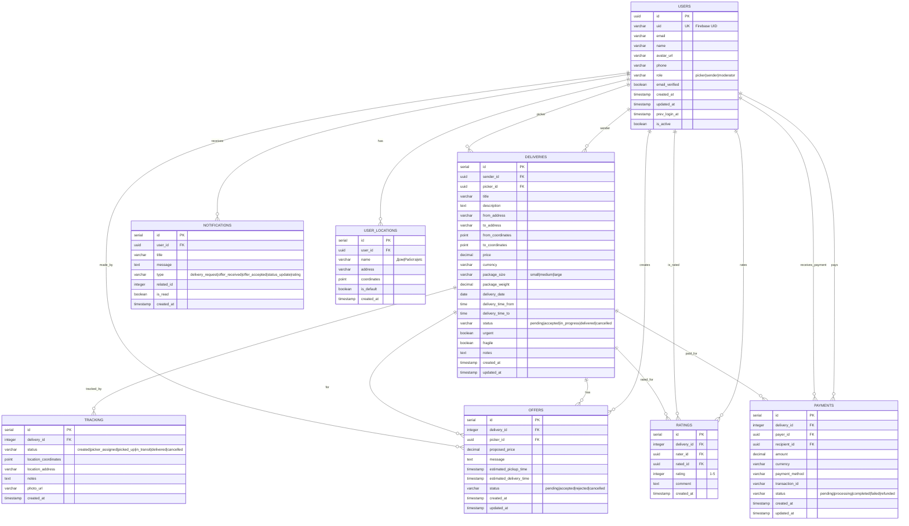

# Pickom Database Schema

## Схема базы данных для приложения доставки Pickom

### Диаграмма связей



## SQL Схема

### 1. Таблица пользователей
```sql
CREATE TABLE users (
    id UUID PRIMARY KEY DEFAULT gen_random_uuid(),
    uid VARCHAR(255) UNIQUE NOT NULL,  -- Firebase UID
    email VARCHAR(255) NOT NULL,
    name VARCHAR(255) NOT NULL,
    avatar_url VARCHAR(500),
    phone VARCHAR(20),
    role VARCHAR(20) NOT NULL CHECK (role IN ('picker', 'sender', 'moderator')),
    email_verified BOOLEAN DEFAULT false,
    created_at TIMESTAMP DEFAULT CURRENT_TIMESTAMP,
    updated_at TIMESTAMP DEFAULT CURRENT_TIMESTAMP,
    prev_login_at TIMESTAMP,
    is_active BOOLEAN DEFAULT true
);

-- Индексы
CREATE INDEX idx_users_uid ON users(uid);
CREATE INDEX idx_users_email ON users(email);
CREATE INDEX idx_users_role ON users(role);
```

### 2. Таблица доставок
```sql
CREATE TABLE deliveries (
    id SERIAL PRIMARY KEY,
    sender_id UUID NOT NULL REFERENCES users(id),
    picker_id UUID REFERENCES users(id),
    title VARCHAR(255) NOT NULL,
    description TEXT,
    from_address VARCHAR(500) NOT NULL,
    to_address VARCHAR(500) NOT NULL,
    from_coordinates POINT,
    to_coordinates POINT,
    price DECIMAL(10,2) NOT NULL,
    currency VARCHAR(3) DEFAULT 'BYN',
    package_size VARCHAR(20) CHECK (package_size IN ('small', 'medium', 'large')),
    package_weight DECIMAL(5,2),
    delivery_date DATE,
    delivery_time_from TIME,
    delivery_time_to TIME,
    status VARCHAR(20) NOT NULL DEFAULT 'pending'
        CHECK (status IN ('pending', 'accepted', 'in_progress', 'delivered', 'cancelled')),
    urgent BOOLEAN DEFAULT false,
    fragile BOOLEAN DEFAULT false,
    notes TEXT,
    created_at TIMESTAMP DEFAULT CURRENT_TIMESTAMP,
    updated_at TIMESTAMP DEFAULT CURRENT_TIMESTAMP
);

-- Индексы
CREATE INDEX idx_deliveries_sender ON deliveries(sender_id);
CREATE INDEX idx_deliveries_picker ON deliveries(picker_id);
CREATE INDEX idx_deliveries_status ON deliveries(status);
CREATE INDEX idx_deliveries_date ON deliveries(delivery_date);
CREATE INDEX idx_deliveries_coordinates ON deliveries USING GIST (from_coordinates, to_coordinates);
```

### 3. Таблица предложений
```sql
CREATE TABLE offers (
    id SERIAL PRIMARY KEY,
    delivery_id INTEGER NOT NULL REFERENCES deliveries(id),
    picker_id UUID NOT NULL REFERENCES users(id),
    proposed_price DECIMAL(10,2),
    message TEXT,
    estimated_pickup_time TIMESTAMP,
    estimated_delivery_time TIMESTAMP,
    status VARCHAR(20) NOT NULL DEFAULT 'pending'
        CHECK (status IN ('pending', 'accepted', 'rejected', 'cancelled')),
    created_at TIMESTAMP DEFAULT CURRENT_TIMESTAMP,
    updated_at TIMESTAMP DEFAULT CURRENT_TIMESTAMP
);

-- Индексы
CREATE INDEX idx_offers_delivery ON offers(delivery_id);
CREATE INDEX idx_offers_picker ON offers(picker_id);
CREATE INDEX idx_offers_status ON offers(status);
CREATE UNIQUE INDEX idx_offers_unique ON offers(delivery_id, picker_id) WHERE status IN ('pending', 'accepted');
```

### 4. Таблица отслеживания
```sql
CREATE TABLE tracking (
    id SERIAL PRIMARY KEY,
    delivery_id INTEGER NOT NULL REFERENCES deliveries(id),
    status VARCHAR(30) NOT NULL
        CHECK (status IN ('created', 'picker_assigned', 'picked_up', 'in_transit', 'delivered', 'cancelled')),
    location_coordinates POINT,
    location_address VARCHAR(500),
    notes TEXT,
    photo_url VARCHAR(500),
    created_at TIMESTAMP DEFAULT CURRENT_TIMESTAMP
);

-- Индексы
CREATE INDEX idx_tracking_delivery ON tracking(delivery_id);
CREATE INDEX idx_tracking_status ON tracking(status);
CREATE INDEX idx_tracking_created_at ON tracking(created_at);
CREATE INDEX idx_tracking_coordinates ON tracking USING GIST (location_coordinates);
```

### 5. Таблица рейтингов
```sql
CREATE TABLE ratings (
    id SERIAL PRIMARY KEY,
    delivery_id INTEGER NOT NULL REFERENCES deliveries(id),
    rater_id UUID NOT NULL REFERENCES users(id),
    rated_id UUID NOT NULL REFERENCES users(id),
    rating INTEGER NOT NULL CHECK (rating >= 1 AND rating <= 5),
    comment TEXT,
    created_at TIMESTAMP DEFAULT CURRENT_TIMESTAMP
);

-- Индексы
CREATE INDEX idx_ratings_delivery ON ratings(delivery_id);
CREATE INDEX idx_ratings_rated ON ratings(rated_id);
CREATE INDEX idx_ratings_rater ON ratings(rater_id);
CREATE UNIQUE INDEX idx_ratings_unique ON ratings(delivery_id, rater_id);
```

### 6. Таблица уведомлений
```sql
CREATE TABLE notifications (
    id SERIAL PRIMARY KEY,
    user_id UUID NOT NULL REFERENCES users(id),
    title VARCHAR(255) NOT NULL,
    message TEXT NOT NULL,
    type VARCHAR(30) NOT NULL
        CHECK (type IN ('delivery_request', 'offer_received', 'offer_accepted', 'status_update', 'rating')),
    related_id INTEGER, -- ID связанной записи (delivery, offer, etc.)
    is_read BOOLEAN DEFAULT false,
    created_at TIMESTAMP DEFAULT CURRENT_TIMESTAMP
);

-- Индексы
CREATE INDEX idx_notifications_user ON notifications(user_id);
CREATE INDEX idx_notifications_unread ON notifications(user_id, is_read);
CREATE INDEX idx_notifications_type ON notifications(type);
```

### 7. Таблица платежей
```sql
CREATE TABLE payments (
    id SERIAL PRIMARY KEY,
    delivery_id INTEGER NOT NULL REFERENCES deliveries(id),
    payer_id UUID NOT NULL REFERENCES users(id),
    recipient_id UUID NOT NULL REFERENCES users(id),
    amount DECIMAL(10,2) NOT NULL,
    currency VARCHAR(3) DEFAULT 'BYN',
    payment_method VARCHAR(30) NOT NULL,
    transaction_id VARCHAR(255),
    status VARCHAR(20) NOT NULL DEFAULT 'pending'
        CHECK (status IN ('pending', 'processing', 'completed', 'failed', 'refunded')),
    created_at TIMESTAMP DEFAULT CURRENT_TIMESTAMP,
    updated_at TIMESTAMP DEFAULT CURRENT_TIMESTAMP
);

-- Индексы
CREATE INDEX idx_payments_delivery ON payments(delivery_id);
CREATE INDEX idx_payments_payer ON payments(payer_id);
CREATE INDEX idx_payments_recipient ON payments(recipient_id);
CREATE INDEX idx_payments_status ON payments(status);
CREATE INDEX idx_payments_transaction ON payments(transaction_id);
```

### 8. Таблица адресов пользователей
```sql
CREATE TABLE user_locations (
    id SERIAL PRIMARY KEY,
    user_id UUID NOT NULL REFERENCES users(id),
    name VARCHAR(100) NOT NULL, -- 'Дом', 'Работа', etc.
    address VARCHAR(500) NOT NULL,
    coordinates POINT,
    is_default BOOLEAN DEFAULT false,
    created_at TIMESTAMP DEFAULT CURRENT_TIMESTAMP
);

-- Индексы
CREATE INDEX idx_user_locations_user ON user_locations(user_id);
CREATE INDEX idx_user_locations_default ON user_locations(user_id, is_default);
CREATE INDEX idx_user_locations_coordinates ON user_locations USING GIST (coordinates);
```

## Триггеры и функции

### Автоматическое обновление времени
```sql
CREATE OR REPLACE FUNCTION update_updated_at_column()
RETURNS TRIGGER AS $$
BEGIN
    NEW.updated_at = CURRENT_TIMESTAMP;
    RETURN NEW;
END;
$$ language 'plpgsql';

-- Применение триггеров
CREATE TRIGGER update_users_updated_at
    BEFORE UPDATE ON users
    FOR EACH ROW EXECUTE FUNCTION update_updated_at_column();

CREATE TRIGGER update_deliveries_updated_at
    BEFORE UPDATE ON deliveries
    FOR EACH ROW EXECUTE FUNCTION update_updated_at_column();

CREATE TRIGGER update_offers_updated_at
    BEFORE UPDATE ON offers
    FOR EACH ROW EXECUTE FUNCTION update_updated_at_column();

CREATE TRIGGER update_payments_updated_at
    BEFORE UPDATE ON payments
    FOR EACH ROW EXECUTE FUNCTION update_updated_at_column();
```

### Функция для расчета расстояния
```sql
CREATE OR REPLACE FUNCTION calculate_distance(
    lat1 FLOAT, lon1 FLOAT,
    lat2 FLOAT, lon2 FLOAT
) RETURNS FLOAT AS $$
BEGIN
    RETURN 6371 * acos(
        cos(radians(lat1)) * cos(radians(lat2)) *
        cos(radians(lon2) - radians(lon1)) +
        sin(radians(lat1)) * sin(radians(lat2))
    );
END;
$$ LANGUAGE plpgsql;
```

## Полезные запросы

### Поиск доставок по расстоянию
```sql
-- Найти доставки в радиусе 10 км от точки
SELECT d.*,
       calculate_distance(
           ST_Y(d.from_coordinates), ST_X(d.from_coordinates),
           53.9, 27.56667  -- Координаты Минска
       ) as distance_km
FROM deliveries d
WHERE calculate_distance(
    ST_Y(d.from_coordinates), ST_X(d.from_coordinates),
    53.9, 27.56667
) <= 10
ORDER BY distance_km;
```

### Статистика пользователя
```sql
-- Рейтинг пользователя
SELECT
    u.name,
    AVG(r.rating) as average_rating,
    COUNT(r.rating) as total_ratings
FROM users u
LEFT JOIN ratings r ON u.id = r.rated_id
WHERE u.id = $1
GROUP BY u.id, u.name;
```

### Активные доставки
```sql
-- Активные доставки с последним статусом
SELECT
    d.*,
    t.status as current_status,
    t.location_address as current_location,
    t.created_at as last_update
FROM deliveries d
LEFT JOIN LATERAL (
    SELECT * FROM tracking
    WHERE delivery_id = d.id
    ORDER BY created_at DESC
    LIMIT 1
) t ON true
WHERE d.status IN ('accepted', 'in_progress');
```

## Рекомендации по развертыванию

1. **База данных**: PostgreSQL 14+ для поддержки геоданных
2. **Расширения**:
   ```sql
   CREATE EXTENSION IF NOT EXISTS "uuid-ossp";
   CREATE EXTENSION IF NOT EXISTS "postgis";
   ```
3. **Индексы**: Настроить GIST индексы для геопространственных запросов
4. **Мониторинг**: Настроить логирование медленных запросов
5. **Бэкапы**: Регулярные бэкапы с учетом GDPR требований

## Версионирование схемы

Рекомендуется использовать миграции для изменений схемы:
- **TypeORM** для NestJS приложения
- **Flyway** или **Liquibase** для production